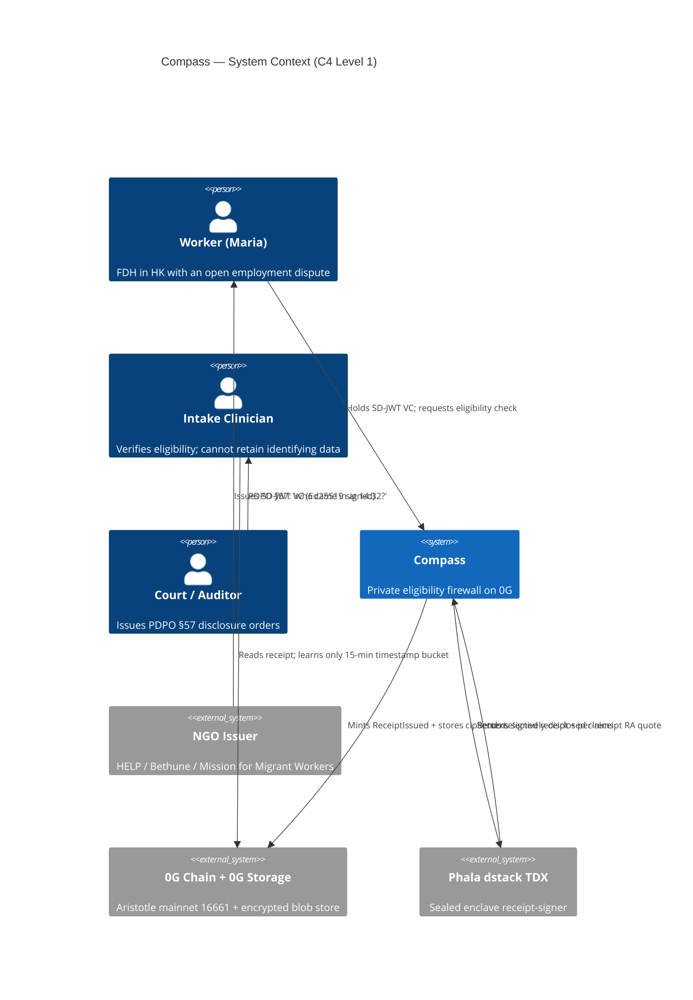

# Compass — Private Eligibility Firewall on 0G

> **Prove eligibility, not identity.**

[](https://github.com/StephenSook/Compass-OG-/actions/workflows/ci.yml)
[](./docs/audits/slither-2026-05-10.md)
[](./LICENSE)
[](https://chainscan.0g.ai/address/0xe42fd4F0a3197126fEeF5e6AAfC5Fb8848bBC58b)
[](https://chainscan-galileo.0g.ai/address/0x60BbE5fcA6D23f7d25142E721258c641b45A7c3b)
[](https://65c93172e22403466eecee47dd1cc90375014a0f-8080.dstack-pha-prod9.phala.network)
[](./docs/whitepaper.pdf)

A private eligibility firewall on 0G — vulnerable migrant workers prove they qualify for services through an autonomous agent, while clinics receive only non-identifying receipts.

**Track 5 — Privacy & Sovereign Infrastructure**, 0G APAC Hackathon 2026.

---

## Table of contents

1. [Watch the demo](#watch-the-demo) — live URLs + 3-minute video
2. [See it live](#see-it-live) — frontend, TEE, contracts, container image
3. [The "shouldn't be possible" moment](#the-shouldnt-be-possible-moment) — what a subpoena actually retrieves
4. [Maria's story](#marias-story) — who Compass is for
5. [What's real / what's mocked](#whats-real--whats-mocked) — honest scope table
6. [Architecture](#architecture) — ASCII + 3D + auto-graph + gource time-lapse
7. [0G integration](#0g-integration) — which 0G layer does what
8. [Replicate the TEE binding yourself](#replicate-the-tee-binding-yourself) — browser + CLI verifier
9. [End-to-end tests](#end-to-end-tests) — Playwright suite
10. [Whitepaper](#whitepaper) — 3-page technical PDF
11. [Pillar 5 — Honesty about traction](#pillar-5--honesty-about-traction) — NGO outreach log
12. [Ecosystem citizenship — `compass-eligibility-check` skill](#ecosystem-citizenship--compass-eligibility-check-skill)
13. [Live attestation evidence (pinned)](#live-attestation-evidence-pinned)
14. [On-chain deployments](#on-chain-deployments) — Galileo + Aristotle addresses
15. [Quickstart (local dev)](#quickstart-local-dev)
16. [Tech stack](#tech-stack)
17. [Pre-submission audit summary](#pre-submission-audit-summary) — Slither, Codex, Vitest, Hardhat, Playwright
18. [Documentation map](#documentation-map)
19. [Honest limits](#honest-limits)
20. [Cite this work](#cite-this-work)
21. [Contributing + security](#contributing--security)
22. [License + credits](#license--credits)

---

## Why this matters

Hong Kong's foreign domestic helpers can be deported in 14 days if they lose their job. Every time they ask for help, they hand over papers that can be subpoenaed back at them. **Compass closes that gap by letting them prove eligibility for a service without revealing who they are** — using verifiable credentials, a sealed enclave, and a 0G-chain receipt that contains no identifying fields. If a court asks the clinic "who came in at 2pm last Tuesday?", the honest answer is "someone qualified for the service." That's the whole disclosure.

---

## Watch the demo

> **3-minute walkthrough:** `[DEMO_VIDEO_URL]` *(YouTube unlisted — drop the URL here once F.1 lands; see `Demo/script.md` for the 6-beat shooting script and `Demo/storyboard.md` for the visual companion).*
>
> The demo records on **Aristotle mainnet** with `NEXT_PUBLIC_COMPASS_USE_MAINNET=1`. Receipts mint to chainId 16661 and land on `https://chainscan.0g.ai`. The Phala dstack TDX enclave must be live during recording — `/api/consume` fails closed (503 `tee_required`) when the CVM is stopped.

---

## See it live

| Layer | URL |
|---|---|
| Frontend | <https://app-psi-pied.vercel.app> |
| Verify a receipt in your browser | <https://app-psi-pied.vercel.app/verify> |
| TEE receipt-signer | <https://65c93172e22403466eecee47dd1cc90375014a0f-8080.dstack-pha-prod9.phala.network> |
| AgentRegistry (0G Galileo) | [`0x461eda452ffAF43c674ef42BdccfDd6B8e13C2D8`](https://chainscan-galileo.0g.ai/address/0x461eda452ffAF43c674ef42BdccfDd6B8e13C2D8) |
| CompassHub (0G Galileo) | [`0x60BbE5fcA6D23f7d25142E721258c641b45A7c3b`](https://chainscan-galileo.0g.ai/address/0x60BbE5fcA6D23f7d25142E721258c641b45A7c3b) |
| Container image | `ghcr.io/stephensook/compass-enclave:1.0.3` |
| Repo | <https://github.com/StephenSook/Compass-OG-> |

The Phala CVM is stopped between demos to save free credits. Click **Start** in the Phala dashboard before judging — receipts cannot be minted while the CVM is off, but the historical attestation evidence is permanent (see [docs/notes/phala-deployment.md](./docs/notes/phala-deployment.md)).

---

## The "shouldn't be possible" moment

Open the [subpoena scene](https://app-psi-pied.vercel.app/clinic/subpoena). Under a PDPO §57 disclosure order, the clinic produces this and only this:

```
14:32 on May 18, 2026 — Someone qualified for free legal assistance.
That's all that exists.
```

No name. No HKID. No employer. No documents. No fields a subpoena can pry open.

---

## Maria's story

Maria works 16 hours a day in a Hong Kong apartment. When she needs free legal help, she should not have to hand over her passport, her contract, and her HKID just to ask the question. Compass lets her prove "I'm an FDH in HK with an open employment dispute" without disclosing who she is. Her credentials stay encrypted on her device. The clinic learns only a bucketed timestamp and a cryptographic commitment.

Maria is a composite — built from research, not a real person. The persona is inspired by the work of [HELP for Domestic Workers](https://helpforfdws.org/), [Bethune House Migrant Women's Refuge](https://www.bethunehouse.org/), and [Mission for Migrant Workers](https://www.migrants.net/) in Hong Kong.

---

## What's real / what's mocked

| Component | Status | Note |
|---|---|---|
| AgentRegistry contract | **real** | ERC-7857 stripped, Galileo deployed; Slither audit clean (0 sec findings) |
| CompassHub contract | **real** | policies + Authwit + receipts, Galileo deployed; 40 unit + 5 property-invariant tests pass |
| Browser AES-256-GCM encryption | **real** | live on `/onboard` step 3 — non-extractable AES-256 in IndexedDB encrypts the issued SD-JWT VC before localStorage persist; plaintext never enters localStorage |
| 0G Storage ciphertext upload | draft | AES-256-GCM round-trip on Node CLI; live 0G upload behind `COMPASS_LIVE_STORAGE=1`; browser-side upload is v2 |
| Receipt-signer service | **real** | dstack TDX dual-boot, per-receipt quote freshness binding |
| Phala Cloud TDX deploy | **real** | live: signer `0xaba6…a7e7`, composeHash `0x1884…cea0`; live state probe at [`/api/tee-status`](https://app-psi-pied.vercel.app/api/tee-status) |
| RA-quote-bound `attestationDigest` in receipts | **real** | `/api/consume` calls live Phala TEE; digest is sha256 of canonicalized receipt + per-receipt TDX quote whose `report_data` binds (signer, image, receiptId) |
| SD-JWT VC live issuer service | draft | `POST /api/issue` Ed25519-signs an SD-JWT VC when `ISSUER_PRIVATE_KEY` env set; rendered in `/vault` from localStorage |
| SD-JWT VC issuers (HELP, Bethune, Hospital) | mocked | real NGOs; signing keys are local Ed25519 fixtures, not endorsed by the NGOs |
| Authwit grant — browser-side EIP-712 signing | **real** | Privy embedded wallet signs the Compass `Grant` typed data on `/onboard` step 4 (chainId 16602, CompassHub verifying contract); no gas, no popup-required sub-flow |
| `CompassHub.consumeGrantAndIssueReceipt` — atomic on-chain | **real** | `POST /api/consume` relays Maria's signed grant; `PROVIDER_PRIVATE_KEY`-held wallet calls Galileo CompassHub; emits `GrantConsumed` + `ReceiptIssued` in one tx |
| Vercel frontend | **real** | server-rendered routes incl. `/vault`, `/about`, `/clinic/subpoena`, env-gated `/onboard` Privy + mint + issue + request-eligibility flow |
| Trust list governance | draft | v1 owner-managed via `docs/policies/*.json`; v2 DAO design specced at [`docs/trust-list-governance.md`](./docs/trust-list-governance.md) (5-of-7 quorum, 7-day timelock with 24h revoke expedite, on-chain TrustList contract on Aristotle) |
| On-chain `verifyAttestation` | stubbed | gas-prohibitive on-chain (cert chain + ECDSA + 4KB quote); off-chain via `verify-receipt` CLI is the honest substitute |
| 0G broker `processResponse` co-signature | draft | out of scope for v1; receipt has its own signature chain |
| Privy embedded wallet integration | draft | wired in `/onboard` step 1 + root provider; live behind `NEXT_PUBLIC_PRIVY_APP_ID`, fixture timer in default build |
| `/onboard` step 2 — live `mintAgent` | draft | Privy embedded wallet → `AgentRegistry.mintAgent` on Galileo, gated on user-funded gas via faucet; fixture timer when Privy unset |
| Aristotle mainnet (chainId 16661) deploy | draft | scaffolded — chain-selector helpers + `activeAgentRegistry`/`activeCompassHub` guards wired; deploy gated on OG funding (see [`docs/notes/0g-mainnet-funding-options.md`](./docs/notes/0g-mainnet-funding-options.md) + [`docs/notes/0g-aristotle-deploy-checklist.md`](./docs/notes/0g-aristotle-deploy-checklist.md)) |

This table also lives at [/about](https://app-psi-pied.vercel.app/about) on the frontend with the same status badges and a live `/api/tee-status` probe above the table.

---

## Architecture

```
┌──────────────────────────────────────────────────────┐
│  USER DEVICE  · Next.js · user-controlled EOA        │
│  • secp256k1 key (Privy wired; fixture by default)   │
│  • AES-256-GCM vault encryption                      │
│  • SD-JWT VC selective disclosure                    │
└────────────────────────┬─────────────────────────────┘
                         │  encrypted vault upload
                         ▼
┌──────────────────────────────────────────────────────┐
│  0G STORAGE  · Galileo testnet · encrypted blob      │
│  • ciphertext SD-JWT bundle                          │
│  • Merkle root → AgentRegistry.encryptedURI          │
└────────────────────────┬─────────────────────────────┘
                         │  selectively-disclosed claims
                         ▼
┌──────────────────────────────────────────────────────┐
│  0G TeeML / PHALA dstack TDX                         │
│  • dstack-derived secp256k1 signer                   │
│  • per-receipt quote: report_data binds              │
│    sha256(ethAddress || composeHash || receiptId)    │
│  • policy evaluator → eligible/denied                │
└────────────────────────┬─────────────────────────────┘
                         │  ReceiptIssued
                         ▼
┌──────────────────────────────────────────────────────┐
│  0G CHAIN  · AgentRegistry + CompassHub              │
│  • soulbound INFT (agent identity)                   │
│  • Authwit grants + nullifier replay protection      │
│  • ReceiptIssued event (15-min bucketed timestamp)   │
└──────────────────────────────────────────────────────┘
```

Visual + section-by-section breakdown: [/about](https://app-psi-pied.vercel.app/about).

### C4 system-context (Mermaid)



### Three pre-rendered views in [`docs/visualizations/`](./docs/visualizations/README.md)

| View | Best for | Open with |
|---|---|---|
| 🎬 [`compass-gource.mp4`](./docs/visualizations/compass-gource.mp4) — animated git-history time-lapse (3.2 MB) | Slide-deck B-roll, hackathon booth loop | Any video player |
| 🛰️ [`compass-architecture-3d.html`](./docs/visualizations/compass-architecture-3d.html) — interactive 3D force graph of the 6 layers (22 hand-curated nodes, bloom + neon, hover-to-trace) | Live demo, judge walkthrough | `python3 -m http.server 8888` then open in browser |
| 🕸️ [`compass-knowledge-graph.html`](./docs/visualizations/compass-knowledge-graph.html) — auto-generated full-codebase graph (484 nodes / 491 edges / 132 communities) via [graphify](https://github.com/sokratesgmbh/graphify) | "What touches `consumeGrantAndIssueReceipt`?" | Same as above |

---

## 0G integration

| Component | 0G Layer | Role |
|---|---|---|
| Agent ID | 0G Chain ([AgentRegistry](https://chainscan-galileo.0g.ai/address/0x461eda452ffAF43c674ef42BdccfDd6B8e13C2D8)) | Soulbound INFT bound to user EOA; carries encrypted vault URI |
| Encrypted vault | 0G Storage | AES-256-GCM ciphertext of SD-JWT bundle; root hash on-chain |
| Sealed inference | 0G TeeML / Phala dstack TDX | Receives selectively-disclosed claims; signs receipt with sealed key |
| Receipt log | 0G Chain ([CompassHub](https://chainscan-galileo.0g.ai/address/0x60BbE5fcA6D23f7d25142E721258c641b45A7c3b)) | ReceiptIssued: receiptId, policyId, nullifier, agentIdCommitment, resultHash, attestationDigest, expiry, 15-min timestamp bucket |

---

## Replicate the TEE binding yourself

**No-CLI path:** open <https://app-psi-pied.vercel.app/verify> in any browser, drop a Compass receipt-bundle JSON, click **Verify receipt →**. Your browser re-runs the four cryptographic checks below using `@noble/curves` + `@noble/hashes` — no clone, no `npm install`, no terminal. Click **Try sample** to load the bundled fixture and watch all four checks tick green in ~150ms (the page auto-swaps the composeHash to the fixture value for that case). Source: [`app/src/lib/verifyReceipt.ts`](./app/src/lib/verifyReceipt.ts).

The CLI scripts below stay as the canonical reference for anyone who'd rather verify in-terminal. Same four checks, same canonicalization, same curve library — `/verify` is a 1:1 browser port.

---

Two scripts let any judge re-verify the cryptographic chain independently. Clone, install, run:

```bash
git clone https://github.com/StephenSook/Compass-OG-.git
cd Compass-OG-/enclave && npm install --legacy-peer-deps
```

### A. Verify the live deploy's attestation

```bash
npm run verify-deploy -- \
  https://65c93172e22403466eecee47dd1cc90375014a0f-8080.dstack-pha-prod9.phala.network
```

Expected output (when CVM is running):

```
[verify-deploy] /health source=tee signer=0xaba6b92ff8199275eb090c9b3049141fd431a7e7
[verify-deploy] ethAddress:    0xaba6b92ff8199275eb090c9b3049141fd431a7e7
[verify-deploy] composeHash:   0x1884e756bba03fc75f8354a04b294372c770a2720a10b7b3c6cd970a42bdcea0
[verify-deploy] running verifyReportDataBinding...
[verify-deploy] OK — quote binds to (ethAddress, composeHash)
```

Captured evidence: [docs/notes/phala-deployment.md](./docs/notes/phala-deployment.md).

### B. Verify a receipt end-to-end (offline OR live OR user-supplied bundle)

```bash
# Offline — verifies the bundled sample receipt without needing Phala running
npm run mint-sample-receipt        # generates enclave/samples/receipt-sample.json
npm run verify-receipt -- --sample \
  --expected-compose 0xabababababababababababababababababababababababababababababababab

# Live — mints a fresh receipt against the running Phala CVM and verifies it
npm run verify-receipt -- \
  --live https://65c93172e22403466eecee47dd1cc90375014a0f-8080.dstack-pha-prod9.phala.network \
  --expected-compose 0x1884e756bba03fc75f8354a04b294372c770a2720a10b7b3c6cd970a42bdcea0

# Bundle — verifies a JSON receipt someone else minted (no network needed)
npm run verify-receipt -- \
  --bundle ./path/to/received-receipt.json \
  --expected-compose 0x1884e756bba03fc75f8354a04b294372c770a2720a10b7b3c6cd970a42bdcea0
```

Expected output (PASS):

```
[verify-receipt] ✓ attestationDigest = sha256(canonicalize(receipt))
[verify-receipt] ✓ signature ECDSA-recovers to claimed signer
[verify-receipt] ✓ receipt.quoteCommitment = sha256(perReceiptQuoteHex)
[verify-receipt] ✓ quote report_data binds (signerAddress || composeHash || receiptId)
[verify-receipt] PASS — receipt verified against TEE attestation.
```

Tampering produces explicit failure codes (`REPORT_DATA_MISMATCH`, `QUOTE_COMMITMENT_MISMATCH`, `ENV_MODE_RECEIPT`, `QUOTE_VERSION_UNSUPPORTED`) — see [`enclave/src/verify-attestation.ts`](./enclave/src/verify-attestation.ts).

Out of scope (next layer): full Intel DCAP verification of the TDX quote signature chain — run via the DStack Verifier or Intel QVL externally.

### C. Tutorial — verify someone else's Compass receipt

If you've received a Compass receipt JSON (e.g., a clinic showed you
their copy and you want to independently confirm it's TEE-attested),
the verifier runs offline in <30 seconds:

```bash
# 1. Clone + install (one-time)
git clone https://github.com/StephenSook/Compass-OG-.git
cd Compass-OG-/enclave
npm install --legacy-peer-deps

# 2. Save the receipt JSON to a file
#    (the bundle should contain receipt, attestationDigest,
#    signature, signerAddress, perReceiptQuoteHex)
cp /path/to/their-receipt.json ./inbound.json

# 3. Verify against the trust anchor pinned in this repo
npm run verify-receipt -- \
  --bundle ./inbound.json \
  --expected-compose 0x1884e756bba03fc75f8354a04b294372c770a2720a10b7b3c6cd970a42bdcea0
```

What you've now proven, independently of any party:

1. The receipt's `attestationDigest` is the canonical sha256 of the
   receipt — no field was tampered.
2. The signature recovers to a specific Ethereum address — that
   address is the receipt-signer.
3. The receipt's `quoteCommitment` is the sha256 of a TDX quote — the
   receipt commits to a specific TDX quote.
4. That TDX quote's `report_data` binds the (signer, image, receiptId)
   triple — defeats archived-quote replay across deployments.
5. The recovered `composeHash` matches `0x1884…cea0` — the same image
   pinned in [`docs/notes/phala-deployment.md`](./docs/notes/phala-deployment.md).

If the bundle is tampered, the CLI exits with a specific failure code
indicating which check failed. There is no graceful-degradation
fallback that hides a tamper.

---

## End-to-end tests

Playwright suite at `app/tests/e2e/` covers page renders, API endpoints,
and browser-side crypto. Three projects run in parallel: chromium-desktop
(1280×800) and chromium-mobile (iPhone 13 viewport).

```bash
cd app
npm install                          # one-time, includes @playwright/test
npm run test:e2e:install             # one-time, installs Chromium
BASE_URL=http://localhost:3000 npm run test:e2e
```

Run against a Vercel deployment (the prod URL is SSO-gated; pass the
deployment-protection bypass token):

```bash
BASE_URL=https://app-psi-pied.vercel.app \
VERCEL_BYPASS_TOKEN=<paste-from-Vercel-Settings-Deployment-Protection> \
  npm run test:e2e
```

Coverage:

| Suite | Asserts |
|---|---|
| `pages.spec.ts` | / + /about (incl. live TEE-status badge) + /vault + /clinic/subpoena + /clinic/inbox + /audit + /policies/help-legal-aid + /receipt/1 + /onboard server-render correctly |
| `api.spec.ts` | /api/tee-status returns valid mode; /api/issue 503-or-200 by env; /api/consume rejects malformed bodies cleanly |
| `crypto.spec.ts` | AES-256-GCM round-trip + GCM auth-tag tamper rejection + IndexedDB CryptoKey persist + StoredLiveCredential type-guard, all via `page.evaluate` against a live origin |

The wallet-gated flows (Privy login → mint → issue → request eligibility)
need a funded Galileo wallet and are deliberately NOT in the suite — they're
covered by manual click-through per the verification protocol in
`feedback_autonomous_verification.md`.

---

## Whitepaper

3-page technical whitepaper covering threat model, architecture,
cryptographic protocol, honest limits, and roadmap:
[`docs/whitepaper.pdf`](./docs/whitepaper.pdf) (markdown source:
[`docs/whitepaper.md`](./docs/whitepaper.md)).

---

## Pillar 5 — Honesty about traction

| # | Target | Type | Drafted | Sent | Replied |
|---|--------|------|---------|------|---------|
| 1 | HELP for Domestic Workers | NGO (persona check) | 2026-05-10 | — | — |
| 2 | Bethune House Migrant Women's Refuge | NGO (persona check) | 2026-05-10 | — | — |
| 3 | Mission for Migrant Workers | NGO (community check) | 2026-05-10 | — | — |
| 4 | Open Society Foundations | Foundation | 2026-05-10 | — | — |
| 5 | Luminate | Foundation | 2026-05-10 | — | — |
| 6 | HK Jockey Club Charities Trust | Foundation | 2026-05-10 | — | — |

Drafts live at [`docs/outreach/`](./docs/outreach/README.md). Even
no-response counts: silence after a logged-and-dated send is a more
honest traction signal than no contact at all. The `Sent` and `Replied`
columns update post-send.

---

## Ecosystem citizenship — `compass-eligibility-check` skill

The receipt verifier above is also packaged as a reusable Claude Code /
OpenClaw skill at [`skills/compass-eligibility-check/`](./skills/compass-eligibility-check/SKILL.md).
Any agent or CI step in the 0G ecosystem can install it and ask
"is this Compass receipt valid?" without needing to clone the full repo
or wire the TEE chain by hand.

Skill inputs:

- a live Phala enclave URL — the CLI mints a fresh receipt and verifies
  the chain end-to-end (`--live` mode), OR
- the bundled sample fixture for offline demos (`--sample` mode)

(A `--bundle <path>` mode for verifying a previously-saved receipt JSON
is on the v2 roadmap.)

Skill output: structured JSON with `verified: true/false` plus the
recovered `signerAddress`, `composeHash`, `policyId`, `timestampBucket`,
`agentIdCommitment`, and per-check pass/fail (`attestationDigestMatch`,
`signatureRecovers`, `quoteCommitmentMatch`, `reportDataBinding`,
`composeHashTrusted`).

Why publish it as a skill: per Track 5's ecosystem-citizenship criterion,
shipping reusable primitives multiplies the project's value beyond a
single demo. The skill format means a downstream agent — clinic intake
bot, partner NGO compliance check, audit pipeline — can verify Compass
receipts with one tool call.

---

## Live attestation evidence (pinned)

| Field | Value |
|---|---|
| Phala URL | `https://65c93172e22403466eecee47dd1cc90375014a0f-8080.dstack-pha-prod9.phala.network` |
| TEE signer eth address | `0xaba6b92ff8199275eb090c9b3049141fd431a7e7` |
| dstack `composeHash` | `0x1884e756bba03fc75f8354a04b294372c770a2720a10b7b3c6cd970a42bdcea0` |
| Phala app ID | `65c93172e22403466eecee47dd1cc90375014a0f` |
| Phala instance ID | `0263ebb91641237ca840f3b46e6f3d56920197ae` |
| Image digest | `sha256:f3ed653050216ee4ad6a332e6e38d02c5d0166ff33b55ff80acd9973ae2727d1` |
| dstack runtime | `dstack-0.5.9` (production channel, not DEV) |
| Quote version | TDX v4 (10020 hex chars) |
| Signature chain entries | 2 |
| Bound at | 2026-05-08T01:38:14 UTC |

---

## On-chain deployments

| Network | Contract | Address |
|---|---|---|
| 0G Galileo (chainId 16602) | AgentRegistry | [`0x461eda452ffAF43c674ef42BdccfDd6B8e13C2D8`](https://chainscan-galileo.0g.ai/address/0x461eda452ffAF43c674ef42BdccfDd6B8e13C2D8) |
| 0G Galileo (chainId 16602) | CompassHub | [`0x60BbE5fcA6D23f7d25142E721258c641b45A7c3b`](https://chainscan-galileo.0g.ai/address/0x60BbE5fcA6D23f7d25142E721258c641b45A7c3b) |
| **0G Aristotle (mainnet, chainId 16661)** | **AgentRegistry** | [`0xf1FAaBef1d00Db1a15b7637Dc0d8526449D06Bf9`](https://chainscan.0g.ai/address/0xf1FAaBef1d00Db1a15b7637Dc0d8526449D06Bf9) |
| **0G Aristotle (mainnet, chainId 16661)** | **CompassHub** | [`0xe42fd4F0a3197126fEeF5e6AAfC5Fb8848bBC58b`](https://chainscan.0g.ai/address/0xe42fd4F0a3197126fEeF5e6AAfC5Fb8848bBC58b) |

Deployer: `0x05b5Bb550eb8401fC4b8a33bf566C03f49ef5d34`. Provider relayer (server-side `consumeGrantAndIssueReceipt` caller): `0xaD736a7233847Cf1D73a7D820b32424CF8125b0a` — funded `0.1 OG` on Galileo, key in `app/.env` + Vercel env. Deployment record: [docs/deployments/](./docs/deployments/). HELP policy registered on Galileo CompassHub at policyId `0x21b8b0e6…2d08f` per [`docs/notes/0g-galileo-policy-setup.md`](./docs/notes/0g-galileo-policy-setup.md).

---

## Quickstart (local dev)

```bash
# Clone
git clone https://github.com/StephenSook/Compass-OG-.git
cd Compass-OG-

# Frontend
cd app && npm install && npm run dev          # → http://localhost:3000

# Receipt-signer (env mode — for development without dstack)
cd ../enclave && npm install --legacy-peer-deps && npx tsc
COMPASS_FORCE_LOCAL=1 \
COMPASS_RECEIPT_SIGNER_KEY=0x0000000000000000000000000000000000000000000000000000000000000001 \
  node dist/server.js                          # → http://localhost:8080/health

# Tests
cd enclave && npx vitest run                   # 103 passed | 3 skipped
cd ../contracts && npx hardhat test            # 40+ unit tests + 5 invariants
```

Production TEE deploy via Phala Cloud: see [enclave/phala/deploy.md](./enclave/phala/deploy.md).

---

## Tech stack

- **Solidity 0.8.24** + **Hardhat** for AgentRegistry + CompassHub
- **TypeScript 5.6** for receipt-signer (Express) + holder/issuer/verifier
- **Next.js 16** App Router + Tailwind v4 (Cinematic Privacy aesthetic)
- **Intel TDX** via **Phala dstack-0.5.9** for the sealed enclave
- **`@phala/dstack-sdk@0.5.7`** for `getKey` / `getQuote` / `info`
- **`@noble/curves`** secp256k1 + **`@noble/hashes`** keccak256/sha256 for receipt signing
- **`@sd-jwt/sd-jwt-vc`** + **`@sd-jwt/jwt-status-list`** for credential issuance + revocation
- **`@0gfoundation/0g-storage-ts-sdk`** + **`@0gfoundation/0g-compute-ts-sdk`** for 0G integration
- **Vercel** for frontend hosting · **GHCR** for the enclave image

103 vitest tests + 95% Solidity branch coverage + Playwright E2E suite at [`app/tests/e2e/`](./app/tests/e2e/) covering page renders + API endpoints + browser-side crypto. CI on every push: [`.github/workflows/ci.yml`](./.github/workflows/ci.yml).

## Pre-submission audit summary

| Check | Tool | Result |
|---|---|---|
| Solidity static analysis | Slither 0.11.5 (101 detectors) | **0 sec findings** · 2 INFO documented in [audit report](./docs/audits/slither-2026-05-10.md) |
| Property-based invariants | Hardhat fuzz | 5 invariants passing (monotonic nullifiers, soulbound, no-receipt-without-grant, etc.) |
| Solidity unit tests | Hardhat / Mocha | 40 passing covering Authwit + policy-registry + atomic-flow + invariants |
| Receipt-signer logic | Vitest | 103 passing |
| Frontend E2E smoke | Playwright (chromium-desktop + chromium-mobile) | scaffolded; suite runs against localhost or Vercel deploy with bypass token |
| Cryptographic adversarial review | Codex (GPT-5.5) pre-submission | **1 BLOCKER fixed** (`agentIdCommitment` mismatch between enclave receipt-doc and on-chain `ReceiptIssued`); 4 MEDIUM resolved or documented in `docs/honest-limits.md` items 15-17 |
| Independent receipt verification | `verify-receipt` CLI | re-derives full TEE chain from a single `receiptId` |

---

## Documentation map

| Doc | Purpose |
|---|---|
| [docs/whitepaper.pdf](./docs/whitepaper.pdf) | 3-page submission whitepaper (threat model + architecture + protocol + honest limits + roadmap) |
| [docs/architecture.md](./docs/architecture.md) | Full architecture walkthrough |
| [docs/threat-model.md](./docs/threat-model.md) | 9 attack surfaces with mitigations |
| [docs/honest-limits.md](./docs/honest-limits.md) | What Compass does NOT protect against (17 items, including Codex pre-review findings) |
| [docs/audits/slither-2026-05-10.md](./docs/audits/slither-2026-05-10.md) | Slither static-analysis audit of AgentRegistry + CompassHub (0 sec findings) |
| [docs/schemas/receipt-v1.json](./docs/schemas/receipt-v1.json) | Canonical receipt schema (v1.2.0) |
| [docs/policies/](./docs/policies/) | Three demo eligibility policies (HELP, Bethune, Hospital) |
| [docs/notes/phala-deployment.md](./docs/notes/phala-deployment.md) | Live TEE deployment evidence |
| [docs/notes/0g-galileo-policy-setup.md](./docs/notes/0g-galileo-policy-setup.md) | Galileo on-chain HELP policy + provider relayer setup |
| [docs/notes/0g-aristotle-deploy-checklist.md](./docs/notes/0g-aristotle-deploy-checklist.md) | 9-step Aristotle mainnet deploy procedure (gated on OG funding) |
| [docs/notes/0g-mainnet-funding-options.md](./docs/notes/0g-mainnet-funding-options.md) | Ranked paths to acquire OG on Aristotle (credits, bridge, onramps, exchanges) |
| [docs/notes/codex-tee-architecture-review.md](./docs/notes/codex-tee-architecture-review.md) | Adversarial architecture review |
| [docs/adr/](./docs/adr/README.md) | Architecture Decision Records — 3 ADRs covering platform choice (0G + Phala TDX), credential format (SD-JWT VC over PCD/ZK), and per-receipt quote binding |
| [docs/trust-list-governance.md](./docs/trust-list-governance.md) | v1 stub → v2 DAO design for trusted-issuer governance |
| [docs/outreach/README.md](./docs/outreach/README.md) | 6 NGO + foundation cold-email drafts (Pillar 5 traction log) |
| [skills/compass-eligibility-check/SKILL.md](./skills/compass-eligibility-check/SKILL.md) | Reusable Claude Code / OpenClaw verification skill |
| [enclave/phala/deploy.md](./enclave/phala/deploy.md) | Phala Cloud deploy runbook |
| [enclave/src/verify-attestation.ts](./enclave/src/verify-attestation.ts) | Verifier-side TEE binding chain |

---

## Honest limits

Compass narrows disclosure but does not eliminate it. Coercion, deniable encryption, full k-anonymity against statistical re-identification, and SD-JWT VC draft churn all remain open issues. See [docs/honest-limits.md](./docs/honest-limits.md) for the full list.

The receipt-signer key is **enclave-bound** by virtue of dstack `getKey`'s deterministic-key-sealed-to-MR_TD primitive plus the per-receipt quote's `report_data = sha256(ethAddress || composeHash || receiptId)` binding. Per-receipt freshness defeats the quote-replay attack a single boot quote would leave open. Verifier-side trust chain documented in [`enclave/src/verify-attestation.ts`](./enclave/src/verify-attestation.ts).

---

## Cite this work

If you reference Compass in academic, journalistic, or developer-survey work, please cite as:

```bibtex
@misc{compass2026,
  title  = {Compass: A Private Eligibility Firewall on 0G},
  author = {Sookra, Stephen},
  year   = {2026},
  url    = {https://github.com/StephenSook/Compass-OG-},
  note   = {0G APAC Hackathon Track 5 (Privacy \& Sovereign Infrastructure).
            Aristotle mainnet (chainId 16661): CompassHub
            0xe42fd4F0a3197126fEeF5e6AAfC5Fb8848bBC58b, AgentRegistry
            0xf1FAaBef1d00Db1a15b7637Dc0d8526449D06Bf9.}
}
```

Plain-text citation: *Sookra, Stephen. Compass: A Private Eligibility Firewall on 0G. 2026. https://github.com/StephenSook/Compass-OG-.*

For media coverage, founder quotes, and brand assets, see [`docs/press-kit.md`](./docs/press-kit.md).

---

## Contributing + security

- [`CONTRIBUTING.md`](./CONTRIBUTING.md) — local setup, conventions, testing expectations.
- [`CODE_OF_CONDUCT.md`](./CODE_OF_CONDUCT.md) — community standards (scoped specifically to Compass' anti-trafficking mission).
- [`SECURITY.md`](./SECURITY.md) — responsible-disclosure policy and reporter hall-of-fame.
- [`CHANGELOG.md`](./CHANGELOG.md) — release notes by milestone.

Issue templates under [`.github/ISSUE_TEMPLATE/`](./.github/ISSUE_TEMPLATE/); PR template at [`.github/pull_request_template.md`](./.github/pull_request_template.md).

---

## License + credits

MIT — see [LICENSE](./LICENSE).

Solo build by **Stephen Sookra** (Atlanta). Pair-coded with **Claude Opus 4.7 (1M context)**, adversarially reviewed by **Codex (GPT-5.5)** for security boundaries, **Gemini 2.5 Pro** for long-context audits.

Persona narrative inspired by the work of HELP for Domestic Workers, Bethune House Migrant Women's Refuge, and Mission for Migrant Workers in Hong Kong. Compass does not represent any real worker; the demo flow is a composite.

Built on the 0G APAC Hackathon, May 2026. Track 5 — Privacy & Sovereign Infrastructure.
